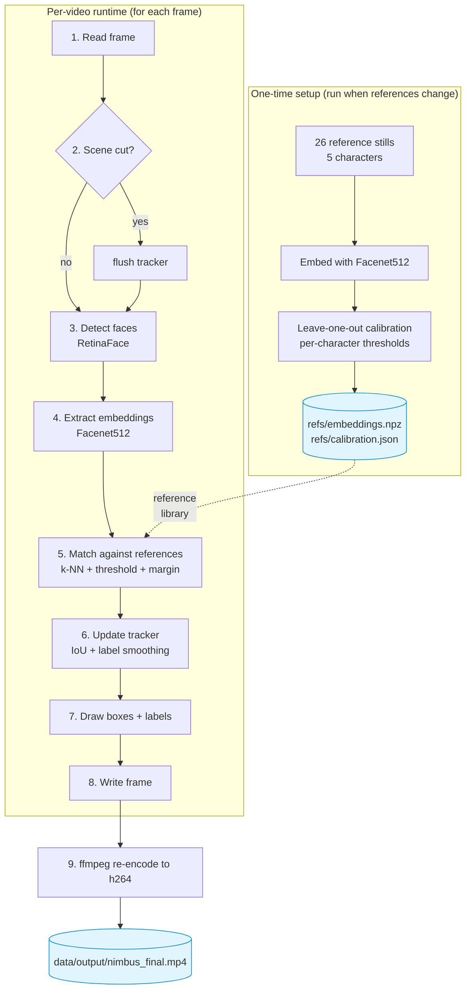

# Nimbus: Face Detection + Character Recognition

Identifies named *Harry Potter* characters (Harry, Ron, Hermione, McGonagall,
Snape) in a 101-second clip from *Philosopher's Stone*, using
[DeepFace](https://github.com/serengil/deepface) with RetinaFace detection
and Facenet512 embeddings.

Built as a take-home assessment for White Swan Data.

---

## In plain English

**The problem.** Given a video, find every face. Name the specific
character where possible.

**The approach.** Two off-the-shelf AI models:
1. **Find faces.** A face detector draws a box around every visible face,
   whether the system can name them or not.
2. **Name faces.** A face recogniser turns each face into a list of
   numbers (a "fingerprint"), compares it against a small set of
   reference photos per target character, and assigns a name when the
   match is close enough. Otherwise the face is labelled `Unknown`.

**Why it errs on the side of `Unknown`.** If the closest match isn't
clearly better than the runner-up, or if the distance is too large, the
system does not commit to a name. The result: it never mislabels anyone
in the evaluation. Precision is 100% on every named character (see the
[Results](#results) table below).

**Headline numbers** on a 76-face evaluation sample, hand-checked:
- **Detection:** every face found. 100%.
- **Named correctly when it committed:** every time. Zero false alarms.
- **Most reliable:** Harry (~78% caught), Snape (~67%).
- **Weakest:** McGonagall appears in one frame of the sample. The
  system identified her but missed its own confidence cutoff by 0.005
  cosine-distance units. We did not nudge the threshold to fix it,
  because that would be tuning on the test set. Full trace in
  [NOTES.md §8](NOTES.md#8-the-mcgonagall-near-miss).

**Why this matters for a real deployment.** Face-recognition systems
that mislabel people are dangerous. A system that reports "I don't know"
when uncertain is safer to put in front of real decisions: sports
broadcast tagging, betting markets, anywhere a wrong name causes
downstream harm.

If terms like "precision", "F1", "embedding", "k-NN" are new, the
[Glossary](#glossary) at the bottom of this file defines every one used
here.

---

## Results

Evaluated on a 40-frame stratified sample (76 GT faces) from the full
clip. All numbers include 95% bootstrap CIs (1000 resamples).

| Character      | Precision | Recall | F1        | F1 95% CI      | GT faces |
|----------------|-----------|--------|-----------|----------------|----------|
| Harry          | 1.000     | 0.783  | **0.878** | [0.743, 0.974] | 23       |
| Snape          | 1.000     | 0.667  | **0.800** | [0.333, 1.000] | 6        |
| Ron            | 1.000     | 0.500  | 0.667     | [0.000, 1.000] | 6        |
| Hermione       | 1.000     | 0.364  | 0.533     | [0.167, 0.800] | 11       |
| McGonagall     | 0.000     | 0.000  | 0.000     | [0.000, 0.000] | 1        |
| Unknown        | 0.617     | 1.000  | 0.763     | [0.462, 0.907] | 29       |
| **Macro avg**  |           |        | **0.607** |                |          |

**Detection recall: 100%** (76/76). Every face got a bounding box,
including back-of-head and profile shots the classifier cannot label.

**Precision = 1.000 on every named class.** When uncertain, the system
falls back to `Unknown`.

> **Reading the table in plain English.**
> - **Precision:** when the system said Harry, how often was it right?
>   1.000 means 100%. Zero false alarms on any named character.
> - **Recall:** of all the actual Harry faces in the sample, how many
>   did we catch? 0.783 means we caught about 78%.
> - **F1:** one score balancing precision and recall. 0 to 1, higher is
>   better.
> - **95% CI:** uncertainty range on the F1 score. Our sample is small
>   (76 faces), so intervals are wide. That width is the story of what
>   we know versus what we guess.
> - The **Unknown** row captures over- and under-confidence. 0.617
>   precision means ~38% of our `Unknown` labels were named characters
>   we were too cautious to name. Recall of 1.000 means every true
>   `Unknown` was labelled as such.

Raw numbers: [`eval/metrics.json`](eval/metrics.json). Methodology:
[§Evaluation](#evaluation). Known limits:
[§Known limitations](#known-limitations). Design decisions:
[NOTES.md](NOTES.md).

## Output video

*(Drive link to `nimbus_final.mp4` goes here before submission.)*

---

## Quickstart

```bash
git clone <repo-url>
cd whiteswan-deepface
pip install -e .

# Download the input clip (provided in the assessment brief) into data/input/
mkdir -p data/input
# Google Drive source:
#   https://drive.google.com/file/d/1CM1IWUN59ZWml9MwgrvSHXz_9AirIiuU/view
# Save the file as data/input/nimbus.mp4, then run:
python run.py data/input/nimbus.mp4 data/output/nimbus_annotated.mp4
```

**First run** downloads ~250MB of model weights (Facenet512 + RetinaFace)
from DeepFace's hosted repo. One-time, cached to `~/.deepface/` thereafter.

**Prerequisites:**
- Python 3.11 (pinned in `pyproject.toml`)
- `ffmpeg` on PATH, used for h264 video re-encoding. Near-universal
  install.

**Platform support:**
- Developed and tested on Linux x86_64 (Ubuntu-family, Python 3.11).
- macOS arm64 (Apple Silicon) should also work via the platform-
  conditional `tensorflow-macos` pin in `pyproject.toml`. Not verified
  on that platform. Please flag any issues.

---

## Smoke mode

Quick ~1-minute sanity check before a full render:

```bash
python run.py --frames 60 data/input/nimbus.mp4 data/output/nimbus_smoke.mp4
```

Full render takes ~1 to 3 hrs on CPU, depending on hardware and face
density.

---

## What's in the repo

```
src/nimbus/        # pipeline: detector, embedder, recogniser, tracker, renderer, scene_cut
scripts/           # ref building, baseline probe, evaluation, plots, diagnostics
references/        # curated reference stills per character (26 total)
refs/              # generated embeddings + LOO-calibrated thresholds (committed)
tests/             # 27 pytest unit tests (tracker, recogniser, scene_cut)
eval/              # ground truth + computed metrics + distribution plots
NOTES.md           # design rationale, decisions, trade-offs
```

---

## How it works

The pipeline runs in two phases. A one-time setup builds the reference
library. A per-video runtime processes each frame.

### Process flow



### Stages explained

**One-time setup** (run once, or again when references change):

1. **Curate references.** 26 film stills hand-picked from roughly the
   right era, 4 to 8 per character. Each image must contain one
   detectable face. Mixed-era shots are rejected.
2. **Embed references.** Each reference runs through Facenet512 to
   produce a 512-number fingerprint. Stored in `refs/embeddings.npz`.
3. **Calibrate thresholds.** Leave-one-out: for each reference, measure
   how far it lands from the rest of its character cluster. The
   tightest threshold that still accepts every legitimate reference
   becomes that character's threshold. Stored in
   `refs/calibration.json`.

**Per-video runtime** (for each frame of the input clip):

1. **Read frame.** OpenCV decodes one frame from the input video.
2. **Scene-cut check.** MABS (mean absolute pixel difference) compares
   the current frame to the previous one. A large change means a new
   shot, so tracker state is flushed to stop labels bleeding across
   cuts.
3. **Detect faces.** RetinaFace finds every face and returns bounding
   boxes plus aligned crops.
4. **Extract embeddings.** Facenet512 turns each aligned crop into a
   512-d fingerprint.
5. **Match against references.** k-NN(k=3) cosine distance against
   every character's reference embeddings. The closest character wins
   only if (a) its mean distance is below that character's calibrated
   threshold, and (b) the gap to the runner-up exceeds the margin.
   Otherwise `Unknown`.
6. **Update tracker.** IoU-matches the detection against active tracks.
   The displayed label is the mode of the recent 7-frame history, so
   single-frame errors don't cause flicker.
7. **Draw boxes and labels.** Colour-coded bounding box plus character
   name and confidence.
8. **Write frame** to an mp4v intermediate file.

**Post-render:**

9. **ffmpeg re-encode** converts the mp4v intermediate to h264 with
   `yuv420p` and `+faststart`, so the output plays in QuickTime, VLC,
   Chrome, and browser embeds.

### Component detail

- **Detector.** DeepFace's RetinaFace. Returns bounding box plus
  aligned crop per face.
- **Embedder.** DeepFace's Facenet512. 512-d L2-normalised vector per
  aligned face.
- **Recogniser.** k-NN(k=3) cosine distance against curated
  references, per-class thresholds calibrated leave-one-out, plus a
  top-1 vs top-2 margin gate that falls back to `Unknown` when
  uncertain.
- **Tracker.** IoU-matched across frames, label smoothed by history
  mode. Flushed on scene cuts so labels don't bleed across shots.
- **Renderer.** Coloured bounding boxes plus confidence-suffixed
  label. h264 mp4 output via ffmpeg re-encode.

> **In plain English.** Frame by frame: find the faces (detector),
> turn each one into a fingerprint of numbers (embedder), compare each
> fingerprint against our reference photos to pick the closest match,
> and decide whether to commit to a name (recogniser). A tracker
> watches the same face across several frames and only changes its
> mind when the evidence shifts. That is what stops the output video
> flickering between "Harry" and "Unknown" on the same face. A
> scene-change detector resets the tracker when the shot cuts, so
> labels don't bleed across unrelated shots.

Full design rationale: [NOTES.md](NOTES.md).

---

## Evaluation

- 40 frames sampled stratified across the 3044-frame clip.
- Each frame's faces hand-labelled via an anchoring-free VLM
  pre-labelling workflow: VLM proposes, human verifies flagged items.
- IoU-matching (≥ 0.5) aligns predictions with GT.
- Per-class precision/recall/F1, confusion matrix, 95% bootstrap CIs.
- `Unknown` is a first-class class. It is not excluded from the macro
  average.

Reproduce:

```bash
python scripts/evaluate.py           # regenerates eval/metrics.json
python scripts/plot_distributions.py # regenerates eval/plots/
```

Deeper methodology (stratified sampling, near-duplicate leakage guard,
no-tuning-on-test discipline):
[NOTES.md §6](NOTES.md#6-evaluation-methodology).

---

## Known limitations

- **Profile faces** (>45° yaw) and **back-of-head shots** are detected
  but labelled `Unknown`. Facenet512 can't embed them reliably.
- **McGonagall** appears in one sampled frame. The model identifies her
  but misses by 0.005 cosine-distance units against a tight per-class
  threshold. Full decision trace in
  [NOTES.md §8](NOTES.md#8-the-mcgonagall-near-miss).
- **Overhead and extreme-angle shots** degrade both detection and
  recognition. Known limit of the recommended models.
- **First run is slow.** ~250MB of model weights download on first
  invocation. Subsequent runs use the cached weights in `~/.deepface/`.

---

## Development

Tests:
```bash
pip install -e .[dev]
pytest           # 27 tests, < 1s, no DeepFace dependency
ruff check .     # lint
```

Build references from scratch:
```bash
python scripts/ingest_candidates.py    # normalise candidate stills
python scripts/build_references.py     # embed via Facenet512
python scripts/validate_references.py  # LOO calibration → refs/calibration.json
python scripts/baseline_probe.py       # feature-space geometry sanity check
```

Diagnose a specific frame:
```bash
python scripts/diagnose_miss.py --frame 2965 --verbose
```

---

## Design notes

See [`NOTES.md`](NOTES.md) for design decisions, trade-offs, epistemic
boundaries, and what I'd do with another week.

---

## Glossary

A short guide to the terminology used here. No prior ML background needed.

- **Bounding box.** The rectangle drawn around a face in the video.
- **Face detection.** Finding faces in an image and drawing bounding
  boxes around them.
- **Face recognition.** Deciding whose face it is.
- **Embedding.** A "fingerprint" of a face, represented as a list of
  512 numbers. Faces of the same person produce similar fingerprints.
  Different people produce different ones. The fingerprint captures
  identity while ignoring pose, lighting, and expression.
- **Cosine distance.** A measure of how different two fingerprints are.
  Ranges from 0 (identical) to 2 (opposite). Lower means more similar.
- **Reference set.** A small collection of known photos per character
  (3 to 8 stills each in our system) that the recogniser compares new
  faces against.
- **Precision.** Of the faces we labelled Harry, what fraction were
  Harry? 1.000 = 100%. No false alarms.
- **Recall.** Of all the actual Harry faces, how many did we catch?
  0.78 = we caught 78%.
- **F1 score.** One number combining precision and recall. Ranges 0 to
  1, higher is better. Used when both kinds of error matter.
- **Macro-F1.** The average F1 across all classes, weighted equally. A
  system that is great at Harry but awful at McGonagall gets pulled
  down.
- **95% Confidence Interval (CI).** The statistical uncertainty around
  a score. "F1 = 0.878 CI [0.743, 0.974]" means: if we re-sampled the
  evaluation set many times, we'd expect 95% of the F1 scores to land
  in that range. Wide intervals mean small sample, more uncertainty.
- **Bootstrap resampling.** A statistical technique for computing
  those confidence intervals from a single evaluation set by repeatedly
  re-sampling with replacement (1000 times in our case).
- **k-NN (k-Nearest Neighbours).** A classic classification approach.
  To name a new face, look at the `k` closest reference fingerprints.
  If they agree, assign that name. We use k=3.
- **Threshold.** The cutoff distance beyond which the recogniser
  decides "too different from any reference, I don't know who this is".
- **Margin gate.** A second safety check. The gap between the best and
  second-best match must be big enough. If top-1 is only barely closer
  than top-2, the system falls back to `Unknown`.
- **Calibration.** Setting thresholds from measured data rather than
  guesswork. We use leave-one-out: hold out one reference at a time,
  measure how far it is from its own class centroid, and use the worst
  case (plus buffer) as the threshold.
- **Tracker.** Software that follows the same face across consecutive
  frames so we can smooth out single-frame errors.
- **IoU (Intersection over Union).** How much two bounding boxes
  overlap. Ranges 0 to 1. The tracker uses IoU to say "this box in
  this frame is probably the same face as that box in the previous
  frame".
- **Hysteresis.** Shorthand for "don't flip your mind at the first
  sign of disagreement". Why labels don't strobe: it takes several
  frames of consistent contradictory evidence to change one.
- **Scene cut.** A hard change of camera angle. The tracker flushes
  its state when one happens, so the label for a new character doesn't
  get polluted by the previous character's history.
- **Ground truth.** The human-verified correct answer. Ours: 76 faces
  hand-labelled (and double-checked) across 40 sample frames.
- **Stratified sampling.** Taking samples evenly across the clip
  rather than clumping them at the start or end. Prevents systematic
  bias.
- **`Unknown` as a first-class class.** We treat "I don't know" as a
  full label, not a silent fallback. It appears in the precision/recall
  table because over-using `Unknown` (being too cautious) is also
  wrong, just in a different direction.
- **DeepFace / RetinaFace / Facenet512.** The pre-built open-source AI
  models we use. **DeepFace** is the Python library. **RetinaFace** is
  the specific face-detection model. **Facenet512** is the specific
  face-embedding model. All three are recommended in the assessment
  brief.

---

## Citations

- [DeepFace](https://github.com/serengil/deepface). Serengil & Ozpinar
  (2020).
- [RetinaFace](https://arxiv.org/abs/1905.00641). Deng et al. (2019).
- [Facenet](https://arxiv.org/abs/1503.03832). Schroff, Kalenichenko &
  Philbin (2015).

## License

MIT. See [`LICENSE`](LICENSE).
